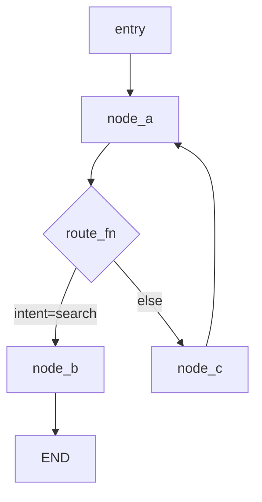

# Graph Map Template

Produce a graph map as the first output of any `/agent-debug` investigation. The graph map provides a shared reference for the diagnosis.

## Format

```
## Graph Map: [GraphName]

### Nodes
| Node | Type | Input fields consumed | Output fields produced |
|------|------|-----------------------|----------------------|
| [name] | [tool|llm|router|human] | field1, field2 | field3, field4 |

### Edges
```
[entry] ──────────────────────────→ [node_a]
[node_a] ──── route_fn ────────────→ [node_b]  (condition: state.intent == 'search')
                        └──────────→ [node_c]  (condition: else)
[node_b] ──────────────────────────→ END
[node_c] ──────────────────────────→ [node_a]  (loop)
```

### State schema
```typescript
// Key fields only
{
  messages: Annotated<list, add_messages>
  userId: str
  intent: "search" | "create" | null
  result: str | null
}
```

### Execution trace (current incident)
1. Entry → node_a ✓
2. node_a → route_fn → node_c ✓
3. node_c → node_a ✓  [LOOP START]
4. node_a → route_fn → node_c ✓
5. node_c → node_a ← **stuck here** (looping, intent never set to 'search' or 'create')
```

## How to build the graph map

1. Read the graph construction code (where `StateGraph()`, `add_node()`, `add_edge()`, `add_conditional_edges()` are called)
2. List all nodes with their function name and type
3. Trace every edge — both static (`add_edge`) and conditional (`add_conditional_edges`)
4. Extract the state schema from `StateAnnotation` / `TypedDict`
5. If logs are available: trace the actual execution path for the failing run

## What to look for in the map

- **Missing terminal condition:** Is there a path from every node to `END`? If not, that's FM-1.
- **Unguarded loop:** Is there a cycle with no counter or escape condition?
- **State schema mismatch:** Does the node return a key that's not in the state schema? Does it try to read a key that's never written?
- **Async/sync mismatch:** Are all nodes consistently `async def` or `def`?
- **Missing interrupt:** Is there a node where human approval should happen but no `interrupt_before` is configured?

## Mermaid version (for reports)


