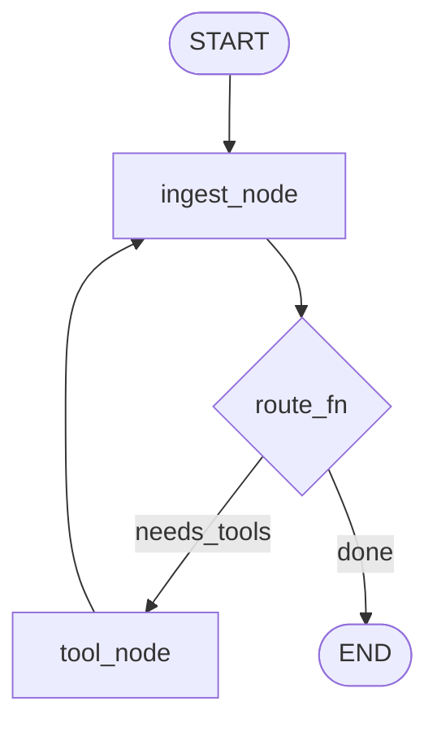
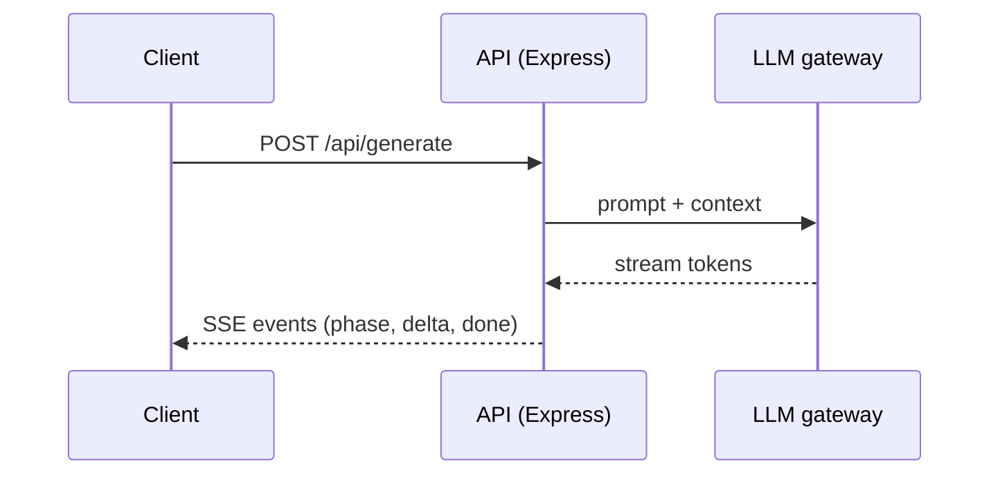
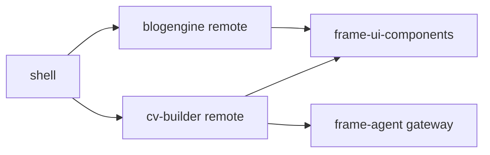
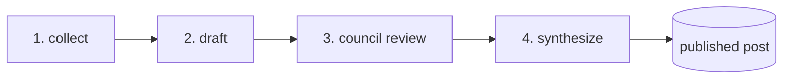

# Mermaid templates

Loaded during `/doc-refactor` Step 4. Common diagram patterns for OJF docs. Keep diagrams small (≤ ~12 nodes); split rather than cram. If the repo has `domain-knowledge/diagram-conventions.md`, its conventions win over these defaults.

## Agent graph (LangGraph state machines)

Conventions: nodes named after the actual node functions; conditional edges labeled with the routing value; always show the path to `END`.

## API flow (request → response, incl. SSE)

Conventions: one participant per process boundary, not per module; label SSE arrows with event names actually emitted.

## Module dependency (workspace / MF topology)

Conventions: arrow = "imports/loads at runtime"; keep direction consistent (consumer → dependency); mark ports only if load-bearing for the doc.

## Pipeline (multi-phase processing)

Conventions: number the phases; use a cylinder/stadium for the terminal artifact; annotate a phase with its owning script when docs reference it (`scripts/generate.mjs`).
