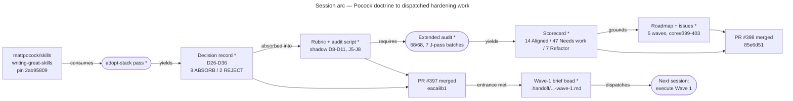
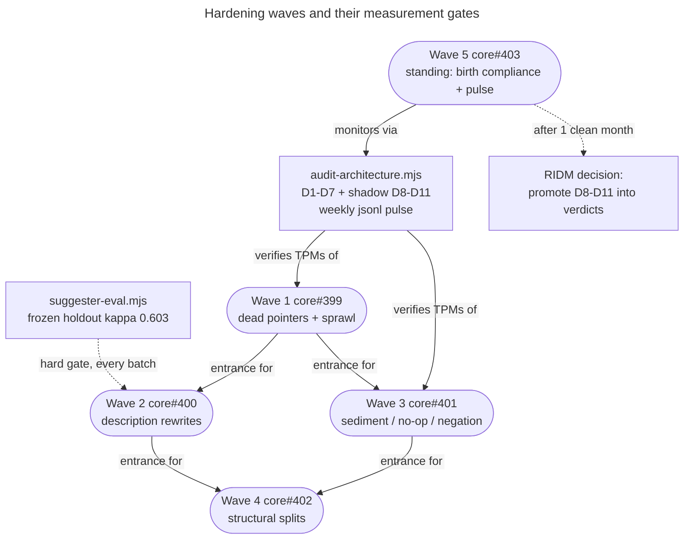

## Context

PRs #397 (Pocock writing-great-skills absorption, D26–D36 → rubric + shadow signals D8–D11 +
J5–J8) and #398 (extended 68-skill audit + 5-wave roadmap) both rebase-merged to main 2026-08-03
(`eaca8b1`, `85e6d51`). Wave 1's entrance criterion (#397 merged) is therefore MET. Issue #399 is
the work order; `decisions/skill-hardening-roadmap.md` is the doctrine; the per-skill evidence
(J verdicts, quotes, fix classes) is in `docs/skill-audit/2026-08-03-extended-audit.md` — read the
"disclose" section of "Findings by fix class" before touching anything.

## Goal

Execute Wave 1 per issue #399, sub-wave 1a before 1b:

- **1a — dead/weak pointers (11 skills):** missing knowledge files (`deploy`, `doc-refactor`,
  `pr-review`, `rag-audit`) — write the file or delete the pointer, per skill, judging from the
  skill's intent; dead See-Also `<skill>/<skill>.md` links (`tdd`, `triage`, `deepen`,
  `writing-fragments`, incl. `/grill-me` → `/grill-with-docs`); wire orphaned must-have files
  (`skill-loader` flows.md, `frame-standup` northstar.md, `bead` bead-schemas.md) and make the
  `wayfinder` fleet-substrate pointer imperative.
- **1b — sprawl disclosure:** push reference into `knowledge/` for the D4/D8 offenders, worst
  first (`merge-quiz`, `selfco-ingest`, `speculative-pass`, `grill-with-docs`, `gated-slice`,
  `blind-sweep`, then remaining D4 fails). Inline only what every branch needs (rubric D30).

## Acceptance criteria

Verify with `node .claude/skills/skill-audit/scripts/audit-architecture.mjs --no-log --format=json`:

- Dead-pointer count = 0 (grep every `knowledge/`-style pointer in each touched SKILL.md against disk)
- D4 pass rate ≥ 95% (≤ 3 fails), sprawl count 30 → ≤ 15, deterministic Aligned ≥ 55
- Zero regressions on D1–D7 for untouched skills (compare against the 2026-08-03 jsonl baseline)
- PR(s) opened against core main; issue #399 updated with the post-run numbers (never auto-close)

## Constraints

- Edits land in `core/.claude/skills/<name>/`, NEVER in `~/.claude/skills/` symlinks.
- Work on a fresh branch off origin/main (the core checkout may be on another branch — use a
  worktree; re-verify branch state before any git op, concurrent agents are active).
- Descriptions and catalog `triggers` are OUT OF SCOPE (Wave 2, eval-gated on suggester holdout
  κ ≥ 0.603). Moving body text into `knowledge/` is in scope; changing frontmatter descriptions
  is not.
- Content moves, it doesn't get rewritten: 1b relocates reference verbatim-ish; sentence-level
  pruning is Wave 3. Splitting skills is Wave 4 — do not split `frame-standup` here, only wire
  its northstar.md pointer.
- pnpm only.

## Flag back

- If a missing knowledge file can't be reconstructed from the skill's intent (e.g. `pr-review`
  framework-checks.md scope is ambiguous), flag the choice (write vs delete pointer) in the PR
  description rather than inventing content silently.
- If disclosure of a specific skill would change its behavior contract (a gate skill's inline
  rigidity, e.g. `gated-slice`), surface it — don't decide unilaterally.
- Anything that looks like it needs a description change to fix properly → note it on issue
  #400 (Wave 2), don't do it here.

## Diagrams

**Caption:** How this program came to exist, in one pass. Nodes marked `*` are new this session;
processes are stadiums, artifacts are rectangles. The upstream Pocock skill was pinned and read
(never vendored — ADR-0083), run through `/adopt-stack` to yield the D26–D36 decision record, whose
ABSORB calls were absorbed into the existing rubric + audit script rather than a parallel Pocock
rubric. That extended apparatus then drove the full-fleet audit (deterministic script + a J1–J8
judgment pass over all 68 skills in 7 subagent batches), whose scorecard grounds the 5-wave roadmap.
Two PRs carried it to main; #397 merging is what flipped Wave 1's entrance criterion, which this
brief dispatches.

**Caption:** What gates what, and which instrument measures it. Wave 1 is the only wave whose
entrance is met; Waves 2 and 3 both unblock on it, and Wave 4 waits on both. The two dotted edges
are the ones worth remembering: the frozen suggester holdout (κ = 0.603, not the remembered 0.700)
is a hard per-batch gate on Wave 2 — a batch that regresses it does not ship — and the shadow
signals stay out of the verdict roll-up until a RIDM promotion after a clean month of pulses.
Everything else is verified by the audit script's own numbers, not by narration.

