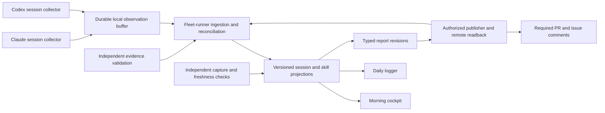

# Fleet runner skill observation design

Date: 2026-10-02. Status: design boundary confirmed; detailed contracts proposed. Owner: core observation contracts and fleet-runner. Initiative: [core #307](https://github.com/ojfbot/core/issues/307).

The operator confirmed observation and reconciliation for all Claude and Codex sessions, including those fleet-runner did not launch, preservation of OPAV evidence validation, distinct acceptance/loading/application/decline/ignore/unknown observations, and no telemetry gate on sessions. This document develops that boundary. It does not accept a runtime, store, host, deployment, data export, or implementation slice.

[Investigation and measured evidence](../../docs/fleet-runner-skill-telemetry-investigation-2026-10-02.md). [Proposed ADR](../adr/draft-fleet-runner-skill-observation.md).

[Verification notes and review links](skill-observation-review.md). Review dispositions belong on PR #501; this specification does not certify its own acceptance.

The operator subsequently required PR and issue comments as reporting outputs and directed application of the structured-correspondence lessons. The [correspondence profile](skill-observation-correspondence.md) is part of this design: typed observations, claims, inferences, assessments, dispositions, and delivery/consumption receipts, with eight falsifiable rule obligations. Detailed contracts remain proposed.

The October 3 [fleet rollout extension](skill-observation-rollout.md) adds the verified
daily-logger failure, inventory-derived denominators, clean-checkout distribution proposal,
snapshot health/attribution requirements and qualification waves within the existing deliveries.
It preserves authorized non-runner, non-fleet and projectless sessions; fleet CI coverage is
only one cohort. The extension grants no collection, export, implementation or publication authority.

## Problem and user outcomes

Suggestion delivery is currently observed in a Codex session whose tool activity is absent from the legacy corroboration ledger. That absence becomes an ignored event. Other reports use incompatible populations and timestamps. The extension must let the operator distinguish a skipped workflow from missing observation and inspect the evidence supporting each statement.

1. As the operator, I want every discovered session to show its capture capability and gaps, so an unsupported host cannot disappear from the denominator.
2. As the operator, I want each delivered suggestion linked to its response and any resulting skill run, so acceptance and application remain distinguishable.
3. As an agent or user, I want deliberate skill invocation recorded without a suggestion, so the system measures the workflow I chose.
4. As a reviewer, I want successful application tied to independently validated evidence, so an assertion or file read cannot manufacture completion.
5. As the operator, I want delayed evidence to correct prior interpretations, so an interruption does not permanently label work ignored.
6. As a skill author, I want definition maintenance reported separately from use, so authoring does not inflate adoption.
7. As a reviewer, I want required PR and issue comments containing scoped findings, evidence, gaps, and corrections from the same snapshot contract as cockpit and daily-logger, so the work remains reviewable where decisions happen.
8. As the operator, I want collector and report-consumption failures surfaced independently, so this does not become another unobserved measurement loop.

## Implementation decisions

The highest-leverage change is to qualify the capture-and-reconciliation path before interpreting adoption. A registration-only patch would miss tool-shape, late-evidence, and reporting defects. A dashboard-only patch would make those defects more visible without repairing them. A new self-report-only ledger would repeat the compliance dependency already rejected by ADR 0095.

### Ownership and data flow

Provider collectors run where sessions run, including on the Mac and in remote workers. Fleet-runner owns ingestion, reconciliation, query contracts, health reporting, and recovery. Core owns shared identities and evidence semantics. Cockpit, daily-logger, PR/issue comment renderers, and audit scripts consume the same versioned projection. They do not independently redefine skill use. Publication intents and remote receipts follow the existing fleet-runner authorization and uncertainty policies. A store write alone does not fulfill a configured reporting obligation.

The buffer is a recoverable transport stage, not a second authoritative skill ledger. Accepted observation facts enter the existing tracking contract through reviewed event-family extensions or a compatible adapter. Derived views remain rebuildable. Do not pick a database or imply that the current JSONL writer already provides durable multi-host ingestion.

### Structured correspondence and ontology

The [correspondence profile](skill-observation-correspondence.md) defines admissible writers, a closed relation vocabulary, heuristic versioning, evidence assessments, and the required PR/issue publication contract. It separates authored claims from derived outcomes; no agent can set a verified result or confirmed delivery through an authored status field. Schema validity establishes shape, not truth. Heuristics produce attributable interpretations whose evidence and qualification remain visible.

This is the normative source for the proposed skill observation scope and implementation entrance.
The profile's original #495 D7 amendment and D8–D10 adaptations cite a historical draft.
#495 merged on October 3 as Proposed documentation with changed D1–D12 meanings, not as
an operative contract. The [profile's current-source reconciliation](skill-observation-correspondence.md#current-source-reconciliation-2026-10-03)
preserves those pins and maps the proposal to the narrowed authority/evidence prerequisites.
Accept the applicable bounded profile in the existing policy venues before governed use;
no fleet-wide grammar or schema package is implicitly required or approved.
Informational reports contain observed dispositions and existing decision links only.
Requests for action or decisions are separate binding speech acts with a named recipient
under the operative correspondence and grant contract.

### Records and meanings

Use separate records for a session, suggestion, skill run, evidence item, and projection revision. A skill run exists even when no suggestion caused it. Associate runs with explicit user invocation, agent choice, suggestion, or injected worker instructions. Optional runner work and attempt IDs link managed execution; ordinary interactive sessions must not require fictitious work orders.

Every observation needs source identity, source event ID or cursor, provider and host, session and turn, event time and ingestion time, adapter/schema version, and evidence provenance. Repo/worktree and parent-session identifiers are nullable when genuinely unknown. Skill identity must include its package or origin and content revision; basename and colon-segment matching alone can collapse different plugins into one skill.

Keep conversation identity separate from execution segments across resumes and forks. Repeated applications of the same skill in one session remain distinct runs; retransmission of one event does not create a new run. Repository identity must survive worktree paths and duplicate directory basenames. A discovered session inventory declares its sources and gaps; it cannot establish that every possible session was discovered.

Suggestion production and confirmed delivery are different facts. Record producer/catalog version and reason separately from the delivered suggestion. For repeated suggestions, link a response or run explicitly; a nearby read must not accept every earlier suggestion of the same skill.

Treat these as separate dimensions, not a single linear status ladder:

| Dimension | Required distinctions |
| --- | --- |
| Observation | Supported and complete for the relevant interval; partial; unavailable; stale; healthy with no matching activity |
| Suggestion response | Explicitly accepted; explicitly declined with reason; deferred; pending; no response observed after a qualified interval; unknown |
| Skill execution | Instructions loaded; workflow started when observable; application claimed; evidence validated; validation failed or indeterminate |
| Purpose | Using a skill; auditing its definition; authoring it; unknown purpose |

The UI may retain the familiar word `ignored` for no response observed after a closed, sufficiently observed interval. It must explain that operational meaning. Missing logs, unsupported tools, interrupted sessions, and an unknown session end yield unknown or pending, never proof of refusal. An explicit decline does not mean the suggestion was bad; preserve its stated reason without inferring motive.

Retain `engaged_no_act`, `capture_miss`, and `skill-authoring` as compatibility concepts where their evidence requirements hold. A file read alone establishes loading, not acceptance, workflow execution, or successful application. A conversational skill can have a session-output reference as its expected evidence; do not force it to manufacture a repository file merely to earn credit.

### Capture and reconciliation

Qualify native tool events, supported hooks, and native transcript replay per provider version. Prefer structured events and successful outcomes. Codex nested `functions.exec` calls require bounded extraction of the actual tool call and result. Do not treat arbitrary command text mentioning `SKILL.md` as a successful load, or tool stdout containing such a string as an instruction. Unsupported or ambiguous operations retain provenance and stay unknown.

Keep agent claims separate from independently collected observations and validated artifacts. Evidence should identify the run, exact artifact revision or content hash, and production interval. An old matching filename or an agent-authored log entry cannot alone prove this run performed the workflow. Validation quality remains distinct from invocation volume.

Register expected-evidence contracts by skill identity and revision, including an explicit loading-only classification where application is not mechanically verifiable. Report missing contracts as indeterminate. A successful event write does not establish validation coverage: this investigation's prescribed `skill-loader` emission was accepted into the ledger but its validator returned no expected-artifact specification.

Use stable source event IDs and ingest checkpoints so hook delivery and transcript replay deduplicate. Acknowledge only after durable acceptance; retry safely after interruption. Preserve gaps, malformed records, version incompatibility, and dropped-event counts as health facts. Schedule catch-up reconciliation as well as live processing, so correctness does not depend on a Stop hook firing.

Persist facts immutably and permit versioned projection corrections. Record input watermarks and projector version. Late evidence should produce a newer interpretation with a reason and reproducible lineage. It must not require deleting the original observation or counting a replay as another run. Event ordering must not rely on wall-clock agreement across hosts.

Install collectors and their validators as pinned runtime releases outside mutable development branches. A session records the installed adapter version and available capture capabilities. Pinning and deployment mechanics remain an implementation decision within fleet-runner's independent deployment boundary.

### Reporting and health

Every report uses a declared cohort, event-time interval, snapshot watermark, projector version, and source coverage. Show delivered suggestions and unique skill runs separately. Report installed, uninstalled, and unknown installation populations; separate authoring and legacy eras. Explicit acceptance, observed loading, verified application, and suggestion quality each need their own denominators.

Unknown cases stay visible next to the denominator. Suppress an adoption claim when coverage is insufficient; zero verified applications with poor coverage is not zero actual applications. A reconciled-session count is not a count of all sessions unless an independent session inventory can establish that denominator. Discovery failures themselves must be observable.

The read model returns these counts even when rates are unqualified. For each report, let D be unique delivered suggestions in the declared interval and population after explicit authoring-only exclusions; let R be unique skill runs in the interval. Display the excluded authoring cohort separately. Count a suggestion once for each applicable metric, even when it links to multiple runs. Counts across response, execution, and coverage dimensions are not summed together.

| Metric | Definition | Coverage condition |
| --- | --- | --- |
| Suggestion delivery | Delivered suggestion count / generated suggestion count | Delivery must be observable; otherwise show counts and unresolved delivery |
| Explicit acceptance | Suggestions in D with explicit acceptance / D | Label as explicit observed acceptance, never infer acceptance from a read; unknown response count accompanies it |
| Suggested loading | Suggestions in D linked to successful instruction loading / D | Qualified loading capture required; report partial cohorts separately |
| Suggested application | Suggestions in D linked to at least one valid evidenced application / D | Run-specific evidence validation required; indeterminate validation remains visible |
| Direct and total use | Counts of R by origin, loading, and evidence verdict | Independent of D; no suggestion-acceptance denominator used |
| Ignored and declined | Separate counts over D | Ignored requires the closed-interval coverage rule; decline requires explicit response |
| Self-report capture | Valid acted claims / valid acted claims plus independently established capture misses | Preserve OPAV's denominator; missing capture capability makes this unqualified, not zero |
| Observation and reconciliation | Qualified discovered sessions / discovered sessions; reconciled suggestions / delivered suggestions | State discovery inventory limits; neither proves universal session coverage |

When only part of D is observable, publish raw counts and coverage rather than an all-session acceptance or application percentage. A qualified subset may have its own labeled rate, but is never silently substituted for D.

PR and issue comments are required outputs for explicitly associated and authorized work targets. Their bodies contain scoped findings and claim-level evidence, not just a dashboard link. The PR pins the reviewed code revision; the issue carries cumulative work dispositions and linked evidence. Preserve exact report revisions and separate publication intent, remote delivery, and consumption. Unrouted sessions and unresolved delivery remain visible. See the profile for append-only corrections, an optional replaceable summary, conflict handling, and confirmed remote readback.

The operator view should answer: what was suggested; how the agent responded; what loaded; what workflow evidence exists; which sessions are missing; and whether the collector, ingestion, validator, or consumer is stale. A report-delivered receipt and an output-consumed receipt are distinct. Retain consumer identity, referenced report revision, action or disposition, and unresolved findings.

An independent watchdog compares expected capture capability with observed progress. It must detect a dead collector, a dead reconciler, and a report that stopped reaching consumers without relying on those components to declare themselves unhealthy. Canaries must be labeled and excluded from adoption counts. Measurements remain advisory; they grant no execution, publication, or merge authority.

### Rollout as vertical slices

These are proposed slices, not registered roadmap entries or delivery claims.

1. Qualify one complete Claude path and one complete Codex path. For each, demonstrate a delivered suggestion, a successful instruction load, an evidenced application, and a deliberately invoked skill with no suggestion. Produce a session receipt and deterministic PR/issue comment bodies through a shared read model using fixture targets. Rendering is not proof of delivery. Include this conversation's false ignored case as a redacted regression fixture.
2. Demonstrate recovery and correction through that same read model. Kill the collector, disconnect ingestion, replay duplicate and late events, omit session-end, and restart from durable checkpoints. Show unknown coverage and later correction without duplicate runs.
3. Qualify publication to explicitly authorized PR and issue test targets through exact-revision readback, deduplicated replay, correction, and uncertain-outcome reconciliation. Demonstrate both configured sinks before marking delivery complete. Cut over cockpit, daily-logger, and audits to the same snapshot contract; prove parity for identical scopes before retiring conflicting calculators.
4. Add independent health and consumption checks. Prove that a deliberately disabled collector and a stopped consumer produce distinguishable findings with a named owner and disposition. Then qualify additional providers, versions, hosts, and skill packages.

The [rollout waves and acceptance cases](skill-observation-rollout.md#rollout-waves-within-the-existing-deliveries)
refine these slices. Daily-logger is the first full qualification case, beginning with local
fixtures and reaching actual PR/issue readback only after separate live authorization.
Broad consumer promotion requires independent discovery/health checks from slice 4;
it cannot postpone detection of missing consumers until after declaring rollout complete.
Report discovered, eligible and qualified populations separately. Qualified workflow
installation alone does not qualify any repository/provider/host observation interval.

### Migration

Preserve historical raw observations and their provenance. Import old ignored events as legacy classifications with unknown coverage unless source evidence qualifies them. Reconcile the original sources when available; never relabel the entire past as accepted or ignored. Preserve existing suggestion IDs and add explicit identity mappings. Document authoring exclusions and unjoinable pre-ID records.

Shadow comparison should run from the same captured input set before consumer cutover. Report disagreement by cause, not just matching percentages. Rollback selects the prior verified projection/consumer version while preserving new facts for replay. It must not re-enable multiple competing authoritative writers.

### Open unknowns

- Deferred decisions: exact response-interval closure, retention and redaction policy, remote export scope, numeric freshness/recovery targets, schema placement, runtime/store selection, and roadmap reconciliation. The operator owns policy decisions; bounded adapter experiments supply feasibility evidence. Existing fleet-runner decisions retain their venues.
- Unvalidated assumptions: native event/transcript access and completeness for all intended Claude/Codex environments; reliable enumeration of sessions not launched by fleet-runner; qualification of wrapped tools and conversational outputs; durable handoff while hosts sleep or disconnect. The local reproduction proves a current gap, not universal API support.
- Standard considerations not evaluated in detail: multi-user permissions, storage/cost limits, deletion requirements, and long-term evidence retention. No raw private transcript export is authorized by this design proposal.

The confirmed boundary has a proposed ADR and an append-only unknowns-ledger entry. Proposed glossary additions appear below; the glossary itself remains unchanged.

## State schema changes

The correspondence profile additionally distinguishes observation, agent claim, interpretation, assessment, disposition, report revision, publication intent, delivery receipt, and consumption receipt. It defines field ownership and typed relations for these records. This table specifies observation-domain fields within that shared grammar; it does not create a second competing authored/derived schema.

Logical fields below are proposed contract requirements, not a selected database schema. Existing TrackingEvent changes require the shared contract review already owned by core.

| Record | Fields and types | Constraints |
| --- | --- | --- |
| Session observation | `session_id: string`, `provider: string`, `host_id: string`, `parent_session_id: string or null`, `repo_id: string or null`, `worktree_id: string or null`, `work_id: string or null`, `attempt_id: string or null` | Namespace session identity by provider and source; unknown repo is explicit; no fabricated runner work ID |
| Observation envelope | `event_id: string`, `source_id: string`, `source_cursor: string`, `occurred_at: timestamp`, `ingested_at: timestamp`, `schema_version: string`, `adapter_version: string`, `evidence_ref: reference or null` | Unique source event key; clocks retained separately; duplicate delivery is idempotent |
| Skill identity | `origin: string`, `name: string`, `revision: string`, `content_digest: string or null` | Explicit catalog alias map; same basenames from different packages remain distinct |
| Suggestion | `suggestion_id: string`, `session_id: string`, `turn_id: string or null`, `skill_id: reference`, `producer_version: string`, `installation: installed or uninstalled or unknown`, `delivery_ref: reference or null` | Existing IDs preserved; generated without delivery proof is excluded from delivered cohort with reason |
| Skill run | `skill_run_id: string`, `session_id: string`, `skill_id: reference`, `origin: user or agent or suggestion or injected or unknown`, `suggestion_ids: reference array`, `observation_refs: reference array` | Exists independently of suggestions; many-to-many attribution requires explicit supporting evidence |
| Evidence verification | `evidence_id: string`, `run_id: reference`, `artifact_ref: reference`, `artifact_revision: string or null`, `verdict: valid or invalid or indeterminate`, `validator_version: string`, `source_refs: reference array` | Self-report and verifier outputs retain separate provenance; unavailable evidence is not valid |
| Coverage interval | `session_id: reference`, `from_cursor: string`, `through_cursor: string`, `capabilities: string array`, `state: complete or partial or unavailable or stale`, `gap_refs: reference array` | Completeness is capability-specific and interval-specific, not a claim about all sessions |
| Projection revision | `subject_id: reference`, `revision: integer`, `projector_version: string`, `input_watermarks: map`, `response: enum`, `execution: enum`, `coverage: enum`, `reason: string`, `supersedes_revision: integer or null` | Response, execution, and coverage are orthogonal; replay cannot erase source facts |
| Consumer disposition | `consumer_id: string`, `snapshot_id: reference`, `delivered_at: timestamp or null`, `consumed_at: timestamp or null`, `action_ref: reference or null`, `disposition: open or acknowledged or acted or deferred or retired` | Delivery alone is not consumption; retirement needs an explicit owner decision |

## Acceptance criteria

The first two slices are scoped to qualified local Claude and Codex versions. Additional providers or versions are reported as unqualified until their own cases pass.

1. Given a delivered suggestion and a successful instruction load in either qualified provider, the session receipt identifies both facts and their source references without calling the load a completed application.
2. Given a deliberately invoked skill with no suggestion, the receipt contains one skill run and no invented suggestion.
3. Given an explicit acceptance, decline, or deferral, the receipt preserves the response and reason where supplied; absence of a response does not create an explicit decision.
4. Given incomplete capture or an open response interval, the receipt reports unknown or pending rather than ignored. Given qualified, complete closed-interval evidence with no response, it reports the operational ignored classification and closure rule.
5. Given a claimed application without valid run-specific evidence, verified-application count stays unchanged; failed reads, old matching files, and definition audits cannot earn application credit.
6. Given authoring and independently evidenced use of one skill in the same session, both tracks remain visible without treating the authoring event as another use.
7. Given delayed evidence after an ignored projection, a newer revision corrects the interpretation; its lineage preserves the earlier revision and source facts.
8. Given duplicate live/replay deliveries, interleaved sessions, or same-name skills from different origins, the reported run count and attribution remain correct.
9. Given collector/ingestion interruption, durable accepted events survive restart and any unsafely lost or unread interval is reported; no stronger loss bound is claimed before an operating policy is accepted.
10. Given the same cohort, bounds, and snapshot ID, all consumers return identical totals and exclusions; event-time filtering stays unchanged by delayed reconciliation.
11. Given a stopped collector or a stopped consumer, an independent check distinguishes the two and emits a finding with an owner and unresolved disposition. A healthy empty interval is different.
12. Given unsupported schema, malformed input, evidence outside authorized roots, or a disallowed export, the boundary returns a structured rejection/gap without blocking the interactive session or publishing private source content.

13. Given a report associated with authorized PR and issue targets, each receives its scoped typed report and verified delivery receipt; pending or uncertain delivery remains incomplete. Late corrections retain prior revision evidence.
14. Given a heuristic interpretation, authored claim, or unverified actor assertion, the system cannot promote it to verified application, confirmed delivery, or human authority without the corresponding assessment or receipt. Rule inventory SC01–SC08 requires executed positive and mutation cases.

## Testing decisions

Test the public observation-to-session-receipt boundary with provider event fixtures, evidence references, and source coverage as inputs. Assert the receipt, report snapshot, and recoverable state after restart. Keep provider qualification as a live integration check; pure projector tests cannot establish native capture. These are proposed testing decisions for implementation review, not a claim that the operator separately approved a test API or runtime.

Existing prior art is the reconcile-skill-acted suite, log-tool-use skill-field suite, OPAV capture-quality gold set, and suggestion identity tests. The 37 targeted existing tests passed during investigation. They do not cover the full proposed behavior. No new implementation tests were added in this documentation change. The correspondence profile adds SC01–SC08 positive/mutation obligations and extends the public test boundary through comment rendering, authorized publication, and independent remote readback. An empty test run cannot qualify an adapter or schema rule.

| Scenarios | Criteria | Test type | Observable assertion |
| --- | --- | --- | --- |
| Delivered suggestion and successful load in each provider | 1, 3 | Live integration plus replay | Receipt contains load provenance and response, without automatic application credit |
| Direct invocation and injected skill | 2 | Integration | One run per observed attempt, no synthetic suggestion |
| Decline, defer, open turn, killed session, absent adapter | 3, 4 | Integration | Response and coverage retain their distinct values |
| Failed read, audit, old file, forged claim, conversational evidence | 5 | Adversarial integration | Only independently validated, run-specific evidence contributes to application |
| Product-near-definition use plus authoring | 6 | Gold-set integration | Use and evolution tracks both retained, neither double-counted |
| Late, duplicate, out-of-order, cross-session, alias-collision events | 7, 8 | Replay/property and integration | Stable identities and deterministic corrected projections |
| Offline spool, process kill, partial append, restart | 9 | Fault integration | Accepted facts survive; gaps are explicit |
| Date bounds and late reconciliation across all consumers | 10 | Contract integration | Identical snapshot totals and cohort membership |
| Disable collector, reconciler, or consumer; healthy-empty control | 11 | Operational qualification | Independent finding distinguishes failure from empty activity |
| Bad schema, untrusted path/URL, redaction/export rejection | 12 | Boundary integration | Reject or mark unknown without unsafe resolution or content export |
| Required PR and issue reporting; failure, uncertain write, correction, replay | 13, SC06–SC08 | Publication fault integration | Exact revision confirmed at each target; no false delivery, duplicate, or fabricated consumption |
| Typed heuristic/claim/assessment lineage, authority, and stale dependencies | 14, SC01–SC05 | Positive and mutation qualification | No promotion of a claim by a score or authored field; affected reports become stale after evidence changes |

## Security considerations

Native transcripts and tool output are untrusted input and may contain secrets. Parse records as data; never evaluate captured JavaScript, shell, or embedded instructions. Bound record size and parser work, record rejected gaps, and preserve source cursors. Evidence resolution must not follow arbitrary paths outside allowed roots or fetch arbitrary URLs. Authenticate remote producers and authorize their host/session namespaces before accepting remote evidence.

The first qualification requires a reviewed redaction manifest before a fixture is committed or shared. Remove raw prompts, tool outputs, credentials, personal or third-party content, private paths, native session/call/suggestion identifiers, and identifying timestamps. Use synthetic fixture identifiers and relative timing; keep any source mapping local under the operator's control. Inspect every fixture and generated report for those exclusions. Excluded or unobservable inputs remain visible as coverage gaps. This minimum applies from slice 1; later retention and remote-export policies may tighten it.

All-session scope deliberately includes the operator's non-fleet and projectless Claude/Codex work: restricting it to registered repositories would miss the interactive use the operator asked to measure. That scope is a reporting goal, not blanket permission to collect other people's sessions or export non-fleet content. Each source needs an explicit authorized scope and exclusion policy before collection; participation by others grants no collection authority. Until those controls are accepted, qualification uses explicitly selected operator-owned local inputs only. Remote rollout additionally requires export, authentication, retention, storage, and recovery policies. Public reporting uses aggregate dispositions and opaque references. This design grants no new publisher or executor authority.

## Revision forecast

These are subjective forecasts for later calibration, not measurements or acceptance confidence. Revisit after implementation review; score whether each choice changed.

| p(revise) | Decision | Why it might change |
| --- | --- | --- |
| 0.75 | Exact response interval and ignored closure rule | Long sessions, interruptions, and provider event semantics need empirical qualification |
| 0.65 | Native hook versus transcript replay mix per provider | APIs and installed capabilities may support different reliable boundaries |
| 0.55 | Runtime deployment and durable ingestion technology | Fleet-runner store and host are still open |
| 0.30 | Projection and consumer snapshot fields | Existing consumers may require compatible field refinements |
| 0.10 | Skill runs independent of suggestions | Deliberate invocation is a directly observed requirement |
| 0.05 | All-session scope, unknown coverage, evidence-backed application, advisory telemetry | Explicitly confirmed boundary and reproduced failure demand these distinctions |

## Out of scope and implementation entrance

The [delivery handoff](skill-observation-delivery.md) defines the first local qualification PR, observable gates, existing-roadmap boundaries, and a pickup instruction.

No changes to suggestion ranking, prompt enforcement, skill installation, live hook configuration, queue transitions, existing publication authority/hold policy, autonomous merge, or numeric adoption targets. Reliable comment publication is specified here as a required reporting behavior, but no live posting or new grant is authorized by this documentation. No universal claim of full telemetry and no reconstruction of intent from missing data.

Before any slice implementation or local experiment begins, obtain approved scope and register the bounded work with an assigned owner in the canonical roadmap. This includes supervised slice-1 pickup, not only unattended dispatch. Reconcile overlapping roadmap work, pin provider versions, review the minimum redaction manifest above, and select policies needed for that slice. The handoff's pickup instruction is inert until these conditions are met.

The first qualification uses explicitly selected local inputs and fixture-only receipts; it neither runs the scheduled-agent evidence probe in #310 nor selects #309's hosting. The #310 → #309 blocking edge remains intact. A production rollout additionally requires the deferred privacy, durability, freshness, and independent-supervision decisions. Do not start a second conductor or treat this proposal as closure of inherited tickets.

## Proposed glossary additions

Add to core CONTEXT only through the normal reviewed vocabulary change: **Skill run**, an identifiable attempt to apply a skill, independent of whether a suggestion caused it; **Capture coverage**, the known completeness and capability of observations over a source interval; **Projection revision**, a reproducible interpretation of retained observation facts at specified watermarks. These additions are proposed here, not silently applied to the glossary.
