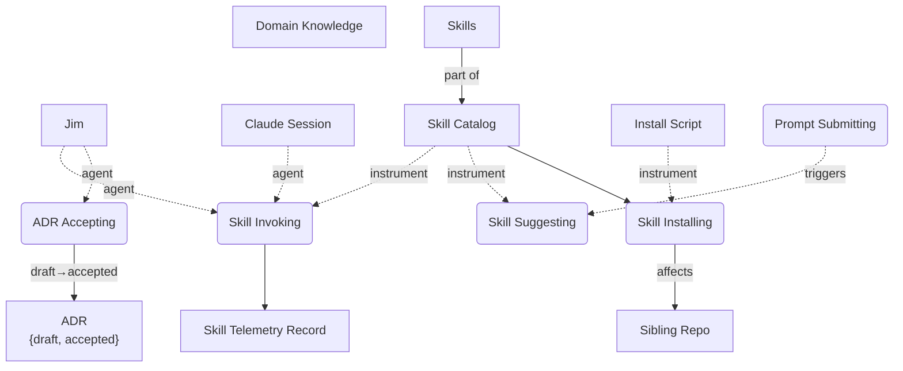
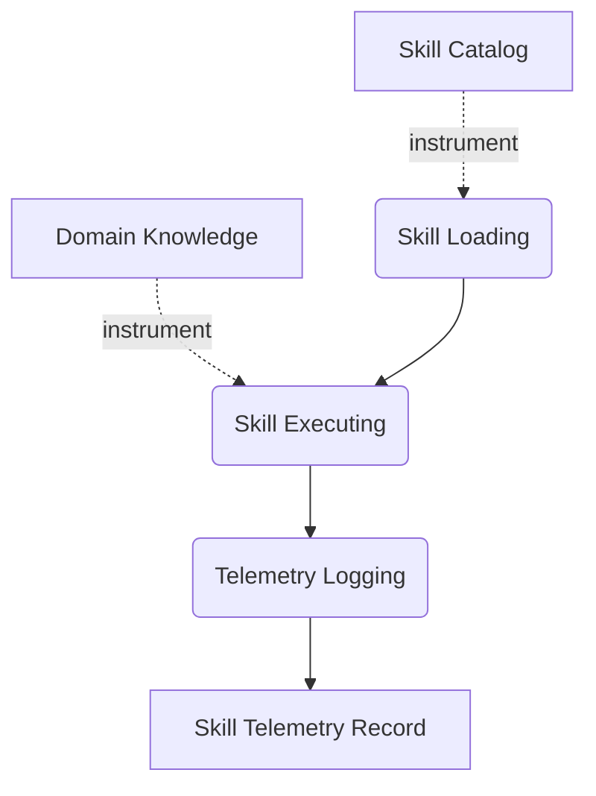

# core — Object-Process Diagrams

> Rendered from `opm/system.opl` by `/opm render`. Do not hand-edit.
> Notation: rectangles = objects, rounded = processes, dotted `agent`/`instrument` edges = enablers.

## SD — core: the skill platform

**OPL paragraph.** Jim is physical. Claude Session is physical. ADR can be draft or accepted.
Skill Catalog consists of Skills. Jim handles Skill Invoking. Claude Session handles Skill
Invoking. Skill Invoking requires Skill Catalog. Skill Invoking yields Skill Telemetry Record.
Skill Suggesting requires Skill Catalog. Prompt Submitting triggers Skill Suggesting. Jim handles
ADR Accepting. ADR Accepting changes ADR from draft to accepted. Skill Installing requires
Install Script. Skill Installing consumes Skill Catalog. Skill Installing affects Sibling Repo.

## SD1.1 — Skill Invoking in-zoom

**OPL paragraph.** Skill Invoking zooms into Skill Loading, Skill Executing, and Telemetry
Logging. Skill Loading requires Skill Catalog. Skill Executing requires Domain Knowledge.
Telemetry Logging yields Skill Telemetry Record.
