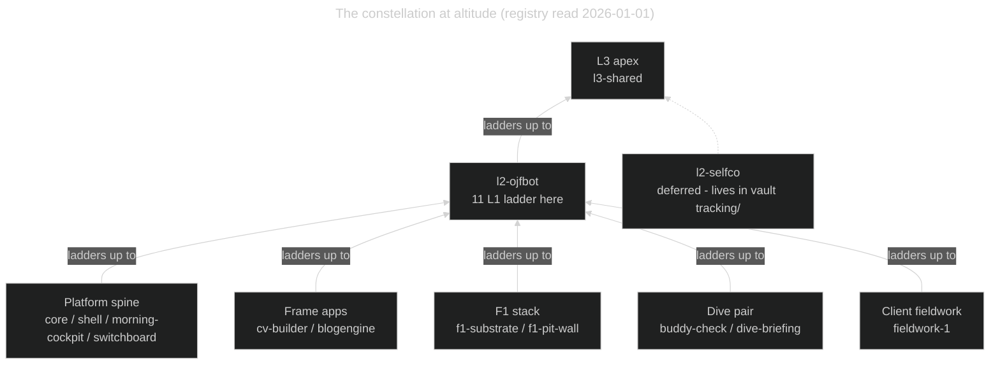

## 2026-01-01 · D5 regenerated from the registry

Generated by `core/scripts/fleet-map-d5.mjs` from `decisions/northstar/README.md` (13 registry entries, 11 L1). Supersedes any earlier D5 in this file; D6–D8 stay authored. D5 is now the one generated diagram here — re-run the generator rather than editing the fence by hand.

**Caption (D5):** Generated from `decisions/northstar/README.md` on 2026-01-01 — 11 L1 northstars in 5 presentation clusters ladder into their L2, then the L3 apex. Presentation clusters are a legibility device with no schema behind them; the registry's unit is the individual northstar, and the cluster *tier* is still designed-not-built (RFQ-004, wayfinder #341). Dashed `l2-selfco` is declared-but-deferred and is not a registry entry — it is owned by the vault (`tracking/`) and referenced by core.

